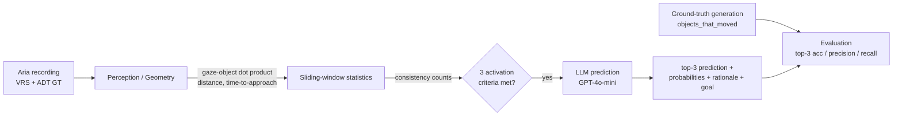
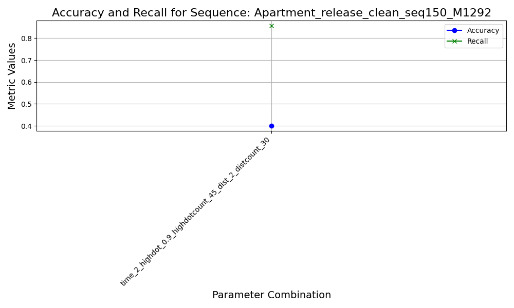

# Next Active Object Anticipation

**Predicting the next object a person is about to interact with, from egocentric (AR-glasses) gaze and motion — using a geometric perception layer and an LLM reasoning layer.**

> Master's thesis project. Built on top of [Project Aria Tools](https://github.com/facebookresearch/projectaria_tools) and the [Aria Digital Twin (ADT)](https://www.projectaria.com/datasets/adt/) dataset (Meta), the original contribution is the full object-anticipation pipeline described below.

<p align="center">
  
  <br/>
  <em>Egocentric view from the Aria glasses: 2D object detections (yellow), the eye-gaze point (red), and the object currently in focus (green) — the signals the pipeline turns into a next-object prediction.</em>
</p>

---

## Motivation

Wearable AR devices and assistive robots need to understand human intent *before* an action happens. Knowing **which object a user will reach for next** enables proactive assistance (highlighting tools, pre-fetching information, anticipating a grasp). This project anticipates the *next active object* from purely egocentric signals — where the user looks, where they move, and how close objects are — and reasons about the user's goal with a large language model.

## What it does

Given an egocentric recording (Aria glasses), at each moment the system:

1. computes **gaze–object alignment** and **user–object distance** for every visible object,
2. tracks these signals over a sliding time window to find objects that are **consistently looked at, close, and quickly reachable**,
3. when these conditions fire, queries an **LLM (GPT-4o-mini)** with the spatial context and the history of past predictions, and
4. outputs a **top-3 prediction** of the next object, a probability distribution, a rationale, and an inferred **user goal**.

Predictions are evaluated against ground-truth object movements derived from the ADT dataset.

## Architecture



See [docs/architecture.md](docs/architecture.md) for a detailed breakdown of each stage.

### Pipeline stages

| Stage | Module | Description |
|-------|--------|-------------|
| **Perception / geometry** | `src/main.py`, `src/utils/tools.py`, `src/utils/stats.py` | Computes the dot product between gaze (camera Z-axis) and the camera→object vector in the XZ plane, user→object distances, and a velocity-based *time-to-approach*. A sliding window (~3 s) accumulates per-object consistency counts. |
| **Candidate filtering & activation** | `src/main.py` | Keeps objects that are highly focused **and** near, then fires the LLM only when an object has enough high-gaze counts, enough proximity counts, and a time-to-approach below threshold. |
| **LLM prediction** | `src/utils/openai_models*.py` | Sends the spatial context + history of past predictions to GPT-4o-mini and parses a structured (YAML) response into possibilities, rationale, top-3 prediction, and user goal. Async/parallel execution with rate limiting. |
| **Ground truth** | `src/gt.py` | Detects when each object actually moved (relative SE3 pose change with EMA smoothing) and writes `objects_that_moved`, `movement_time_dict`, `user_object_movement`. |
| **Evaluation** | `src/utils/evaluation.py`, `src/utils/stats.py` | Aligns prediction times with ground-truth interaction times and reports detection accuracy/precision/recall and top-3 object accuracy. |

## Results

Evaluated on ADT apartment sequences (food-preparation and work scenarios) across a grid of activation thresholds.

| | |
|---|---|
|  |  |

More plots (per-parameter TP/FP breakdowns, bar charts) are in [`docs/results/`](docs/results/).

## Installation

```bash
git clone https://github.com/PetrosPoly/next-active-object-anticipation.git
cd next-active-object-anticipation

python -m venv .venv && source .venv/bin/activate
pip install -r requirements.txt

cp .env.example .env   # then add your OPENAI_API_KEY
```

## Data

This project uses the **Aria Digital Twin (ADT)** dataset, which must be downloaded
separately (it is **not** included in this repo). Follow the official instructions:
<https://facebookresearch.github.io/projectaria_tools/docs/open_datasets/aria_digital_twin_dataset/>

Each sequence folder should contain `video.vrs`, `aria_trajectory.csv`, and the ADT
ground-truth files. Point the pipeline to it via configuration (see below).

## Usage

```bash
# 1. Generate ground truth (objects that moved + timings) for a sequence
python src/gt.py --sequence_path Apartment_release_clean_seq150_M1292

# 2. Run the anticipation pipeline (with LLM predictions)
python src/main.py --sequence_path Apartment_release_clean_seq150_M1292 --use_llm

# 3. Evaluate predictions against ground truth
python src/results_parallel.py
```

Outputs are written per parameter combination as
`large_language_model_{prediction,possibilities,rationale,goals}.json`.

> **Note on configuration:** dataset and project paths are set in `configs/` /
> environment variables (see [Configuration](#configuration)) rather than hardcoded.

## Configuration

Activation behaviour is controlled by a small set of thresholds (gaze/proximity
consistency, time-to-approach, sliding-window length, LLM re-activation timing).
These are documented in `configs/default.yaml`.

## Repository structure

```
src/
├── main.py                     # entry point: per-frame perception + LLM activation
├── gt.py                       # ground-truth generation
├── utils/
│   ├── stats.py                # sliding-window stats, time-to-approach
│   ├── tools.py                # geometry helpers (visibility, transforms, EMA)
│   ├── openai_models*.py       # LLM prediction backends (sync / async / parallel)
│   ├── evaluation.py           # metrics
│   ├── objectsGroup_user.py    # area-change detection for LLM re-activation
│   └── rate_limit.py           # API rate limiting
├── visualization/rr.py         # rerun.io 3D visualization
└── results_parallel.py         # batch evaluation
docs/                           # architecture + result plots
notebooks/                      # analysis notebooks
configs/                        # pipeline parameters
```

## Built on / Acknowledgements

- [Project Aria Tools](https://github.com/facebookresearch/projectaria_tools) — Meta (Apache-2.0)
- [Aria Digital Twin dataset](https://www.projectaria.com/datasets/adt/) — Meta

See [`NOTICE`](NOTICE) for attribution details.

## License

Apache-2.0 — see [`LICENSE`](LICENSE).
