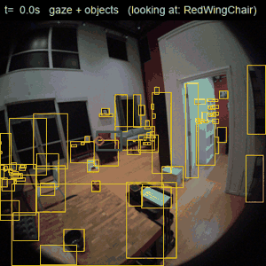
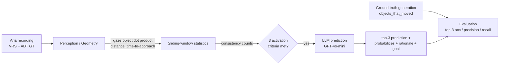
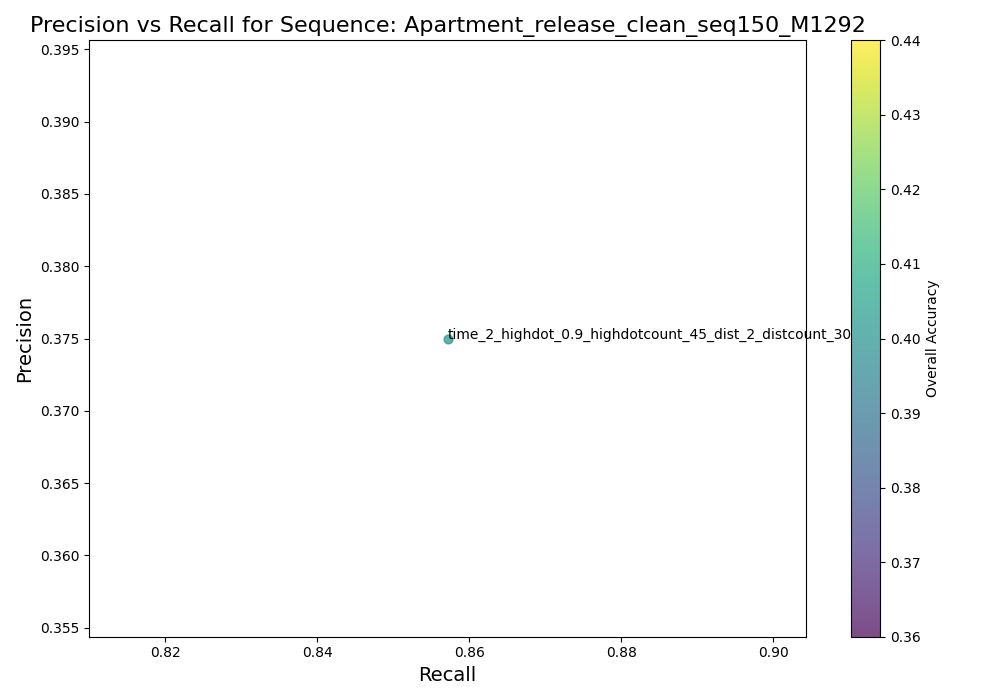

# Next Active Object Anticipation

**Predicting the next object a person is about to interact with, from egocentric (AR-glasses) gaze and motion — using a geometric perception layer and an LLM reasoning layer.**

> Master's thesis project. Built on top of [Project Aria Tools](https://github.com/facebookresearch/projectaria_tools) and the [Aria Digital Twin (ADT)](https://www.projectaria.com/datasets/adt/) dataset (Meta), the original contribution is the full object-anticipation pipeline described below.

<p align="center">
  
  <br/>
  <em>Egocentric view from the Aria glasses: 2D object detections (yellow), the eye-gaze point (red), and the object currently in focus (green) — the signals the pipeline turns into a next-object prediction.</em>
</p>

▶ **[Watch the algorithm explainer video](docs/algorithm_demo.mp4)** — the egocentric stream with the live LLM top-3 prediction, inferred goal, and the ground-truth object the user actually reaches for.

---

## Motivation

Wearable AR devices and assistive robots need to understand human intent *before* an action happens. Knowing **which object a user will reach for next** enables proactive assistance (highlighting tools, pre-fetching information, anticipating a grasp). This project anticipates the *next active object* from purely egocentric signals — where the user looks, where they move, and how close objects are — and reasons about the user's goal with a large language model.

## What it does

Given an egocentric recording (Aria glasses), at each moment the system:

1. computes **gaze–object alignment** and **user–object distance** for every visible object,
2. tracks these signals over a sliding time window to find objects that are **consistently looked at, close, and quickly reachable**,
3. when these conditions fire, queries an **LLM (GPT-4o-mini)** with the spatial context and the history of past predictions, and
4. outputs a **top-3 prediction** of the next object, a probability distribution, a rationale, and an inferred **user goal**.

Predictions are evaluated against ground-truth object movements derived from the ADT dataset.

## Architecture



See [docs/architecture.md](docs/architecture.md) for a detailed breakdown of each stage.

### Pipeline stages

| Stage | Module | Description |
|-------|--------|-------------|
| **Perception / geometry** | `src/pipeline/perception.py`, `src/utils/stats.py` | Computes the dot product between gaze (camera Z-axis) and the camera→object vector in the XZ plane, user→object distances, and a velocity-based *time-to-approach*. A sliding window (~3 s) accumulates per-object consistency counts. |
| **Candidate filtering & activation** | `src/pipeline/activation.py` | Keeps objects that are highly focused **and** near, then fires the LLM only when an object has enough high-gaze counts, enough proximity counts, and a time-to-approach below threshold. |
| **LLM prediction** | `src/pipeline/llm_step.py`, `src/utils/openai_models_work.py` | Sends the spatial context + history of past predictions to GPT-4o-mini and parses a structured (YAML) response into possibilities, rationale, top-3 prediction, and user goal. |
| **Ground truth** | `src/gt.py` | Detects when each object actually moved (relative SE3 pose change with EMA smoothing) and writes `objects_that_moved`, `movement_time_dict`, `user_object_movement`. |
| **Evaluation** | `src/evaluation/metrics.py`, `src/evaluation/results_parallel.py` | Aligns prediction times with ground-truth interaction times and reports detection accuracy/precision/recall and top-3 object accuracy. |

## Results

Evaluated on ADT apartment sequences (food-preparation and work scenarios) across a grid of activation thresholds.

| | |
|---|---|
|  |  |

More plots (per-parameter TP/FP breakdowns, bar charts) are in [`docs/figures/`](docs/figures/).

## Installation

The environment is managed with [uv](https://docs.astral.sh/uv/). `projectaria-tools`
installs as a prebuilt wheel — **no C++/CMake build needed** (the Meta source build is
only required to modify the library itself, which this project does not).

```bash
git clone https://github.com/PetrosPoly/next-active-object-anticipation.git
cd next-active-object-anticipation

uv sync                 # creates .venv/ and installs pinned deps (incl. python 3.10)
uv sync --extra llama   # optional: also install the Llama backend

cp .env.example .env    # then add your OPENAI_API_KEY (only needed for --use_llm)
```

<details><summary>pip alternative</summary>

```bash
python3.10 -m venv .venv && source .venv/bin/activate
pip install -r requirements.txt
```
</details>

## Data

This project uses the **Aria Digital Twin (ADT)** dataset, which must be downloaded
separately (it is **not** committed — it is large and Meta-licensed). Follow the
official instructions:
<https://facebookresearch.github.io/projectaria_tools/docs/open_datasets/aria_digital_twin_dataset/>

Place each sequence under `data/adt/`, e.g. `data/adt/Apartment_release_clean_seq150_M1292/`
(containing `video.vrs`, `aria_trajectory.csv`, and the ADT ground-truth files).
`--sequence_path` is the full path to that folder.

## Usage

The quickest path is the demo script (perception-only by default — no API key, no cost):

```bash
./run_demo.sh data/adt/Apartment_release_clean_seq150_M1292            # perception only
./run_demo.sh data/adt/Apartment_release_clean_seq150_M1292 --use_llm  # with LLM predictions
```

Or run the stages directly with `uv run`:

```bash
cd src
SEQ=../data/adt/Apartment_release_clean_seq150_M1292

uv run gt.py   --sequence_path "$SEQ"              # 1. ground truth
uv run main.py --sequence_path "$SEQ"              # 2. perception-only (no API key)
uv run main.py --sequence_path "$SEQ" --use_llm    # 2b. with LLM predictions
uv run main.py --sequence_path "$SEQ" --make_video # 2c. export an annotated mp4
uv run python -m evaluation.results_parallel       # 3. evaluate
```

To regenerate the explainer video at the top of this README from existing predictions:

```bash
uv run tools/make_algorithm_video.py \
    --sequence data/adt/<seq> \
    --predictions data/adt/<seq>/<param_folder> \
    --out docs/algorithm_demo.mp4
```

Outputs are written per parameter combination as
`large_language_model_{prediction,possibilities,rationale,goals}.json`.

## Configuration

- **Paths** — `configs/config.yaml` holds `project_path` (used to locate prompts, logs and
  ground-truth files). Leave it empty to auto-resolve to the `src/` directory, or set
  the `PROJECT_ROOT` environment variable. No absolute paths are hardcoded.
- **Activation thresholds** — gaze/proximity consistency, time-to-approach, sliding-window
  length and LLM re-activation timing are defined in `src/pipeline/experiment_config.py`
  (and documented for reference in `configs/default.yaml`).
- **Activation gate** — `ACTIVATION_MODE` in `experiment_config.py` selects `"soft"`
  (default: a weighted, temporally-smoothed score over focus/proximity/time-to-approach,
  tuned by `SOFT_ACTIVATION_THRESHOLD` / `SOFT_SCORE_EMA_ALPHA`) or `"strict"` (the
  original AND-of-3-criteria). Compare the two with `evaluation/select_best.py`.
- **LLM prompts** — the prompt template lives in `src/utils/txt_files/prompts.txt`.

## Repository structure

```
configs/                        # all configuration (no config in src/)
├── config.yaml                 # paths (project_path auto-resolves) + prompt filename
└── default.yaml                # reference parameter values
src/
├── main.py                     # entry point: per-frame orchestration loop
├── gt.py                       # ground-truth generation
├── pipeline/                   # the anticipation pipeline
│   ├── perception.py           # visible objects, scene axes, dot-products/distances, filtering
│   ├── activation.py           # LLM activation criteria + re-activation gating
│   ├── state.py                # UserMotionState, ActivationState (cross-frame state)
│   ├── llm_step.py             # gate -> LLM query -> parse -> record -> log
│   └── experiment_config.py    # parameter grid + output naming
├── evaluation/                 # metrics & batch evaluation (run: python -m evaluation.results_parallel)
│   ├── metrics.py              # LLMEvaluation
│   ├── results.py
│   └── results_parallel.py
├── utils/                      # tools, stats, openai_models_work, llama, objectsGroup_user, ...
│   └── txt_files/prompts.txt   # LLM prompt template
└── visualization/rr.py         # rerun.io 3D visualization
tools/make_algorithm_video.py   # render the explainer video from predictions
data/adt/<seq>/                 # ADT sequences — dataset ONLY (downloaded; gitignored)
results/                        # generated outputs (NOT in data/)
├── gt/<seq>/                   #   ground-truth JSONs from gt.py
└── predictions/<seq>/<params>/ #   LLM prediction JSONs from main.py
docs/                           # architecture, result plots, demo.gif, algorithm_demo.mp4
configs/                        # reference parameter values
pyproject.toml / uv.lock        # uv-managed environment
.venv/                          # local environment (gitignored)
```

> `data/` holds only the raw dataset; everything the pipeline generates goes to `results/`.

> The full set of experimental scripts, alternative LLM backends and analysis
> notebooks from development is preserved on the [`raw-sep2025`](https://github.com/PetrosPoly/next-active-object-anticipation/tree/raw-sep2025) branch.

## Built on / Acknowledgements

- [Project Aria Tools](https://github.com/facebookresearch/projectaria_tools) — Meta (Apache-2.0)
- [Aria Digital Twin dataset](https://www.projectaria.com/datasets/adt/) — Meta

See [`NOTICE`](NOTICE) for attribution details.

## License

Apache-2.0 — see [`LICENSE`](LICENSE).
