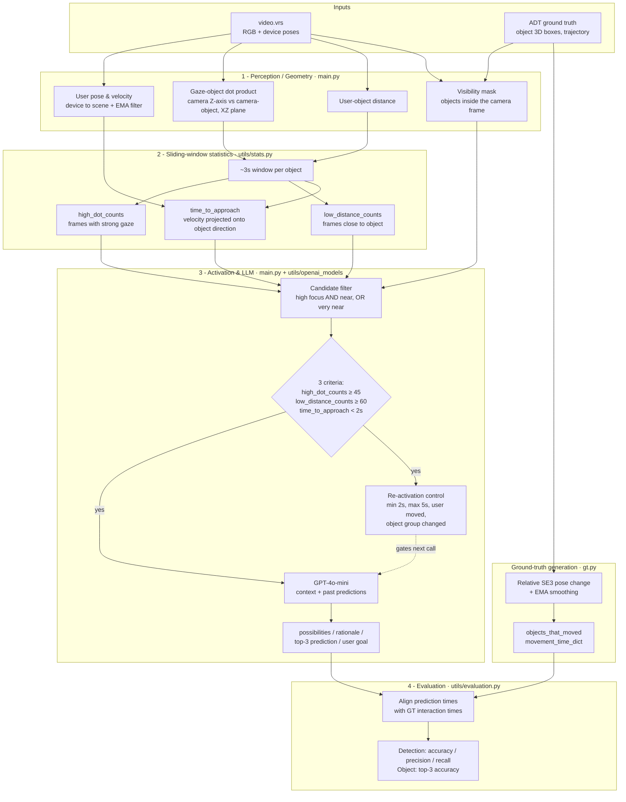

# Architecture

The pipeline turns a raw egocentric recording into a stream of "next object"
predictions, then scores those predictions against ground truth.

## End-to-end flow

## Stage details

### 1. Perception / geometry
For every RGB frame the device pose is read and converted from the device frame to
the scene frame; the user position and velocity are smoothed with an exponential
moving average (alpha = 0.9). For each object visible in the camera frame the system
computes:

- **Gaze–object dot product** — the camera's Z-axis (viewing direction) vs. the unit
  vector from the camera to the object, both projected onto the **XZ plane** (the
  vertical Y component is dropped). A value near `1.0` means the user is looking
  straight at the object.
- **Distance** from the user to the object.
- **Time-to-approach** — the user's velocity projected onto the direction toward the
  object gives an estimated time to reach it.

### 2. Sliding-window statistics
A per-object window (~3 s) accumulates how *consistently* each object is looked at
(`high_dot_counts`) and how *consistently* it is close (`low_distance_counts`), plus
the running time-to-approach. Consistency — not a single frame — is what signals
intent.

### 3. Activation & LLM prediction
Candidates are filtered (high focus **and** reasonably near, or low focus **and** very
near). The LLM is queried only when an object simultaneously satisfies three criteria:
strong gaze consistency, proximity consistency, and a short time-to-approach. The LLM
receives the per-object counts, values, time-to-approach, and the history of past
predictions, and returns a structured response: a probability-ranked list of objects,
a per-object rationale, a top-3 prediction, and an inferred high-level goal. A
re-activation controller prevents redundant calls (no sooner than 2 s, forced after
5 s, or earlier if the user moves significantly or the surrounding object group
changes).

### 4. Ground truth & evaluation
Ground truth is generated by detecting per-object motion from the relative SE3 pose
change between consecutive frames (with EMA smoothing and a small threshold).
Predictions are then aligned in time with actual interactions and scored on two
levels: **detection** (did we fire at the right time — accuracy/precision/recall) and
**object identity** (was the moved object in the predicted top-3).
